# DevOps Portfolio Stack (Docker Compose)

A self-hosted DevOps lab built with Docker Compose.

This project is made for learning and portfolio use. It shows a full local DevOps workflow:

- source control with **Gitea**
- CI/CD with **Jenkins**
- code quality checks with **SonarQube**
- image publishing to a private **Docker Registry**
- monitoring with **Prometheus** and **Grafana**

It also includes a small **demo app** so you can test the full pipeline from start to finish.

> This stack is for local or demo use. It uses simple HTTP and basic credentials. It is not hardened for production.

---

## What This Project Includes

- **Nginx** reverse proxy for local domain routing
- **Gitea** for self-hosted Git repositories
- **Jenkins** for CI/CD pipelines
- **SonarQube** with **PostgreSQL** for code analysis
- **Docker Registry** for storing built images
- **Prometheus** for metrics collection
- **Grafana** for dashboards
- **node-exporter** and **cAdvisor** for host and container metrics

---

## How the Stack Works

The basic workflow is:

1. You push code to **Gitea**
2. **Jenkins** pulls the repository
3. Jenkins runs the pipeline:
   - tests the app
   - scans the code with SonarQube
   - builds a Docker image
   - pushes the image to the private registry
4. **Prometheus** collects metrics
5. **Grafana** shows dashboards for the host and containers

---

## Service URLs

After setup, these services are available through the Nginx reverse proxy:

- Gitea: `http://gitea.local`
- Jenkins: `http://jenkins.local`
- SonarQube: `http://sonarqube.local`
- Grafana: `http://grafana.local`
- Prometheus: `http://prometheus.local`

Docker Registry runs on:

- `http://<SERVER_IP>:5000`

Replace `<SERVER_IP>` with the IP address of the machine running Docker.

---

## Requirements

Before you start, make sure you have:

- Linux machine or VM
- Docker installed
- Docker Compose v2 installed (`docker compose`)
- At least **4 GB RAM** minimum
- A few GB of free disk space

Check Docker:

```
docker --version
docker compose version
```

## Important Host Setting for SonarQube

SonarQube needs this Linux kernel setting:

```
sudo sysctl -w vm.max_map_count=262144
```

To make it permanent:

```
echo "vm.max_map_count=262144" | sudo tee /etc/sysctl.d/99-sonarqube.conf
sudo sysctl --system
```

If you skip this, SonarQube may fail to start.

---

## Project Structure

This project contains:

- the Docker Compose stack
    
- configuration files
    
- bootstrap script
    
- a demo application inside `demo-app/`
    

The demo app includes:

- `Dockerfile`
    
- `Jenkinsfile`
    
- `sonar-project.properties`
    
- Node.js application files
    

---

## Step 1: Clone the Repository

```
git clone https://github.com/mahdavi-morteza/docker-mastery.git
cd projects/devops-stack-ci-observability/devops-stack
```

## Step 2: Create the Environment File

Copy the example environment file:

```
cp .env.example .env
```

Then open `.env` and change the passwords to your own values.

---

## Step 3: Add Local Domain Names

This project uses local domains like `gitea.local` and `jenkins.local`.

On the computer where you will open the web UI, edit your `/etc/hosts` file:

```
sudo nano /etc/hosts
```

Add this line and replace `<SERVER_IP>` with your Docker host IP:

```
<SERVER_IP> gitea.local jenkins.local sonarqube.local grafana.local prometheus.local
```

Example:

```
10.0.0.12 gitea.local jenkins.local sonarqube.local grafana.local prometheus.local
```

Save the file.

---

## Step 4: Start the Stack

The easiest way is to use the bootstrap script:

```
./scripts/bootstrap.sh
```

This script should:

- load values from `.env`
    
- generate the Docker Registry auth file
    
- start all containers with Docker Compose
    

You can check running containers with:

```
docker compose ps
```

If everything starts correctly, open these in your browser:

- `http://gitea.local`
    
- `http://jenkins.local`
    
- `http://sonarqube.local`
    
- `http://grafana.local`
    
- `http://prometheus.local`
    

> On the first start, SonarQube may need a few minutes. If you see a temporary `502 Bad Gateway`, wait and refresh.

---

## Step 5: First-Time Setup

After the containers are running, some services still need manual setup in the browser.

### 5.1 Gitea Setup

Open:

```
http://gitea.local
```


Do the following:

1. Log in with the admin credentials from `.env`
    
2. Create an organization, for example: `acme`
    
3. Create users:
    
    - `dev1`
        
    - `ci-bot`
        
4. Create a repository inside the organization:
    
    - `demo-app`
        
5. Give `ci-bot` access to the repository
    
6. Create an access token for `ci-bot`
    

This token will be used by Jenkins.

---

### 5.2 SonarQube Setup

Open:

```
http://sonarqube.local
```


Do the following:

1. Log in as admin
    
2. Open your profile
    
3. Go to **My Account → Security**
    
4. Generate a token for Jenkins
    
5. Copy and save the token
    

You will add this token to Jenkins in the next step.

---

### 5.3 Jenkins Setup

Open:

```
http://jenkins.local
```

Log in with the Jenkins admin account.

Then add these credentials:

Go to:


```
Manage Jenkins → Credentials → Global → Add Credentials
```

Add the following three credentials.

#### Gitea credentials

- Kind: **Username with password**
    
- Username: `ci-bot`
    
- Password: `<ci-bot password or token>`
    
- ID: `GITEA_CI_BOT`
    

#### SonarQube token

- Kind: **Secret text**
    
- Secret: `<your SonarQube token>`
    
- ID: `SONAR_TOKEN`
    

#### Registry credentials

- Kind: **Username with password**
    
- Username: `registryuser`
    
- Password: `<registry password from .env>`
    
- ID: `REGISTRY_CREDS`
    

---

## Step 6: Push the Demo App to Gitea

Now push the included demo app to the Gitea repository you created.

Go into the demo app folder:

```
cd demo-app
```

Initialize Git and push the code:

```
git init
git add .
git commit -m "Initial demo app"
git branch -M main
git remote add origin http://gitea.local/acme/demo-app.git
git push -u origin main
```

If Git asks for credentials, use a user that has access to the repository, such as `dev1`.

> Make sure the branch is called `main`. If Jenkins is set to `main` but the repo uses `master`, the pipeline will fail.

---

## Step 7: Create the Jenkins Pipeline Job

In Jenkins:

1. Click **New Item**
    
2. Name it: `demo-app-pipeline`
    
3. Select **Pipeline**
    
4. Choose **Pipeline script from SCM**
    
5. Select **Git**
    
6. Use this repository URL:

```
http://gitea:3000/acme/demo-app.git
```

7. Select credentials: `GITEA_CI_BOT`
    
8. Set branch to:

```
*/main
```

9. Set script path to:
```
Jenkinsfile
```

10. Save the job
    
11. Click **Build Now**
    

---

## Step 8: Verify Everything Works

### Jenkins

The pipeline should pass these stages:

- Test
    
- SonarQube Scan
    
- Build
    
- Push
    

### SonarQube

Open SonarQube and check that:

- the `demo-app` project exists
    
- analysis results are visible
    
- issues and code quality data are shown
    

### Registry

On the Docker host, check the private registry:

```
curl -u registryuser:<REGISTRY_PASSWORD> http://<SERVER_IP>:5000/v2/_catalog
curl -u registryuser:<REGISTRY_PASSWORD> http://<SERVER_IP>:5000/v2/demo-app/tags/list
```

### Prometheus

Open:

```
http://prometheus.local/targets
```

Targets should be `UP`.

### Grafana

Open Grafana and verify the dashboards show host and container metrics.

---

## Step 9: Run the Demo App from the Registry

After Jenkins pushes the image, you can pull and run it manually.

Log in to the registry:

```
docker login <SERVER_IP>:5000
```

Pull the image:

```
docker pull <SERVER_IP>:5000/demo-app:latest
```

Run the container:

```
docker run -d --name demo-app -p 3000:3000 <SERVER_IP>:5000/demo-app:latest
```

Then open:

```
http://<SERVER_IP>:3000
```

---

## Common Docker Commands

### Show running containers

```
docker compose ps
```

### Stop everything but keep data

```
docker compose stop
```

### Start again

```
docker compose start
```

### Remove containers but keep data

```
docker compose down
```

---

## Full Reset

Sometimes changing values in `.env` is not enough, because services save data inside Docker volumes.

If logins or passwords do not match your new `.env` values, do a full reset:

```
docker compose down -v --remove-orphans
```

Then start again:

```
./scripts/bootstrap.sh
```

> This deletes saved service data and gives you a clean fresh install.

---

## Data Persistence

This project uses Docker volumes for persistent data.

That means these services keep their data even if containers are removed:

- Gitea
    
- Jenkins
    
- SonarQube
    
- PostgreSQL
    
- Registry
    
- Prometheus
    
- Grafana
    

Because of this, passwords and settings from an earlier run may still exist until you delete the volumes.

---

## Troubleshooting

### I changed `.env`, but the old passwords still work

This is normal.

Many services store credentials in Docker volumes after the first start. Changing `.env` later does not automatically update stored credentials.

Fix:

```
docker compose down -v --remove-orphans  
./scripts/bootstrap.sh
```

---

### SonarQube does not start

Check `vm.max_map_count` first:

```
sysctl vm.max_map_count
```

It should be:

```
262144
```

If not, set it as described earlier in this README.

---

### SonarQube shows `502 Bad Gateway`

This usually happens only during the first startup.

Wait a few minutes and refresh the page.

---

### Jenkins cannot build Docker images

Make sure Jenkins can access Docker through the mounted socket.

This project uses `/var/run/docker.sock` for that purpose.

If Docker access is missing or permission is wrong, image build and push steps will fail.

---

### Jenkins cannot clone the repo

Check these points:

- the repository exists in Gitea
    
- the branch is really named `main`
    
- Jenkins is using the correct credentials
    
- the SCM URL in Jenkins is correct
    

Correct internal Gitea URL for Jenkins:

```
http://gitea:3000/acme/demo-app.git
```

---

### Registry authentication fails

Make sure:

- the `registry/auth/htpasswd` file exists
    
- the username and password in Jenkins match the registry credentials
    
- the values in `.env` and the bootstrap script use the same variable names
    

---

## Security Notes

This project is intentionally simple so it is easy to learn.

For a more secure real-world version, you should add:

- HTTPS / TLS
    
- proper DNS
    
- Docker secrets or secret management
    
- stronger access control
    
- token rotation
    
- restricted registry access
    

---

## Screenshots / Proof

The following screenshots show the stack working:


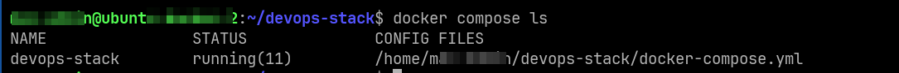

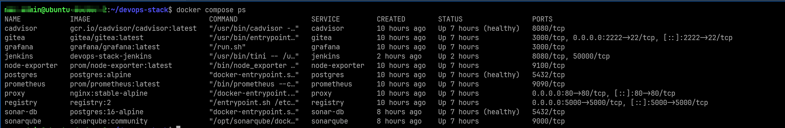

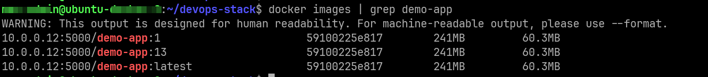

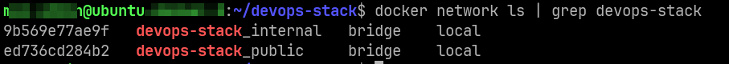

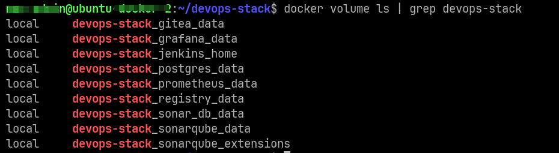

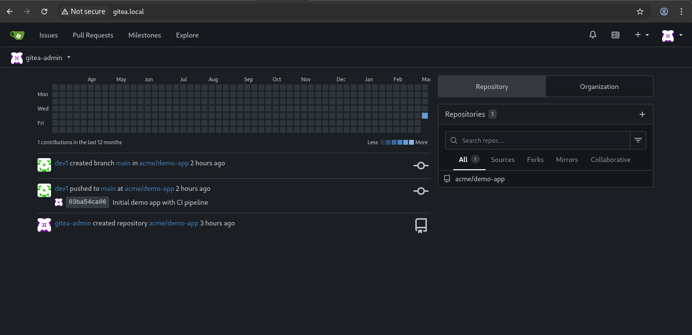

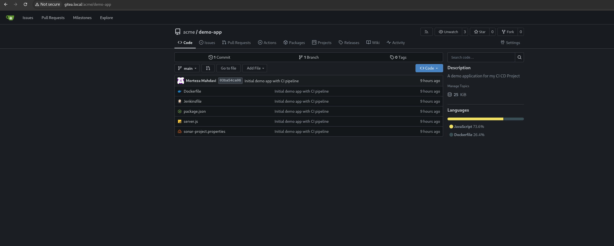

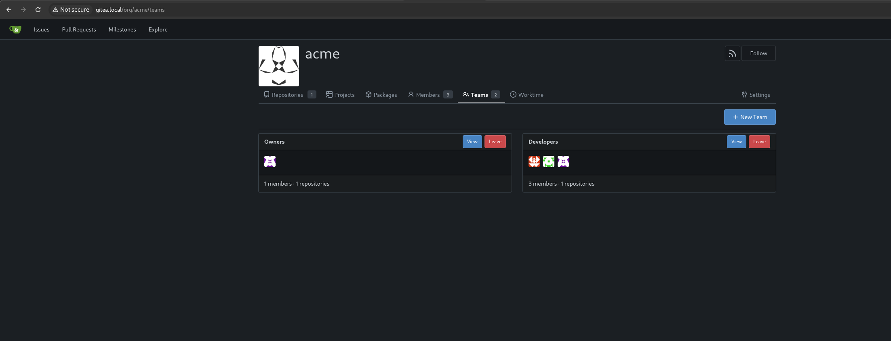

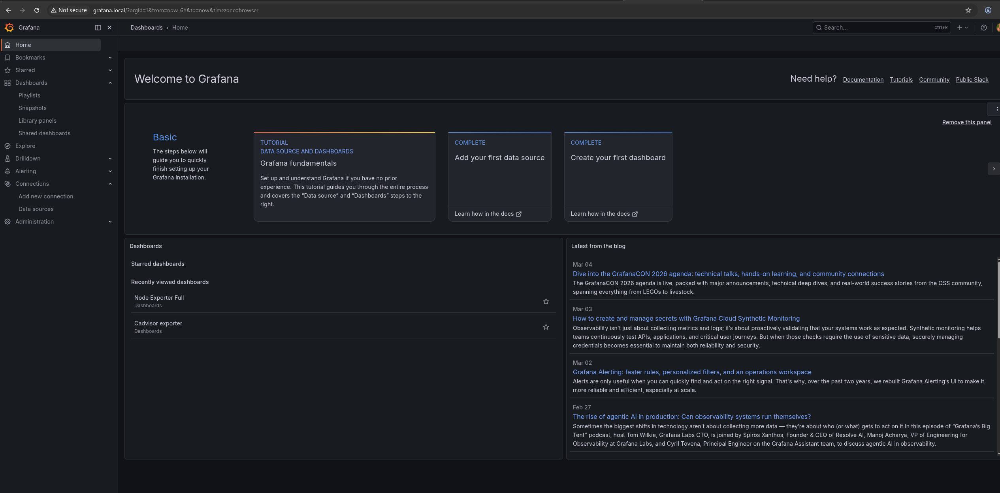

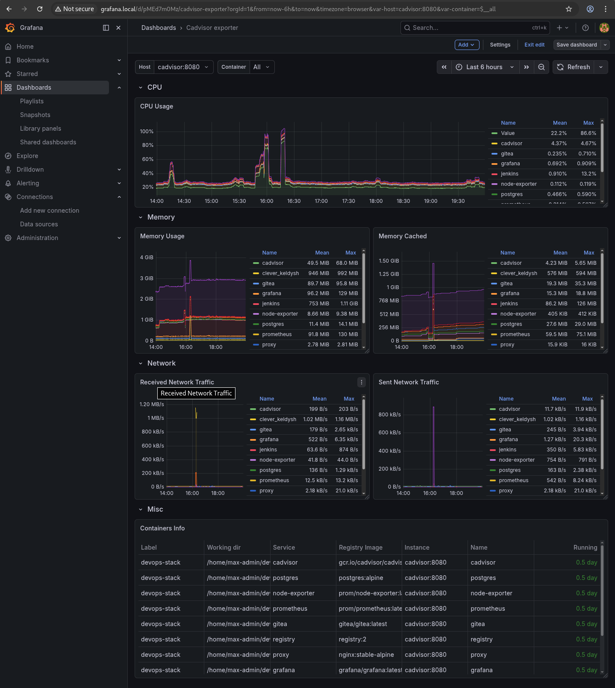

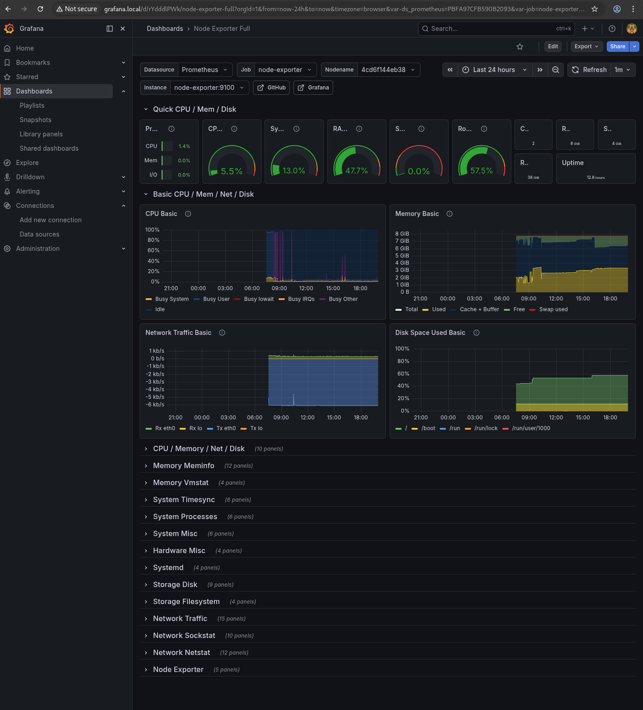

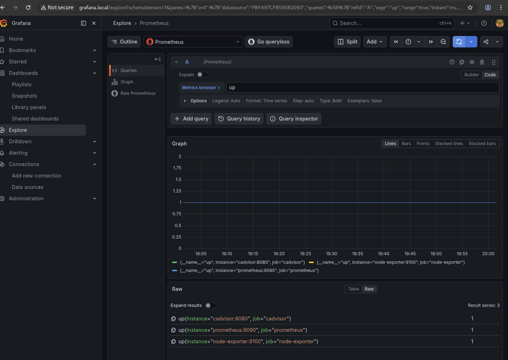

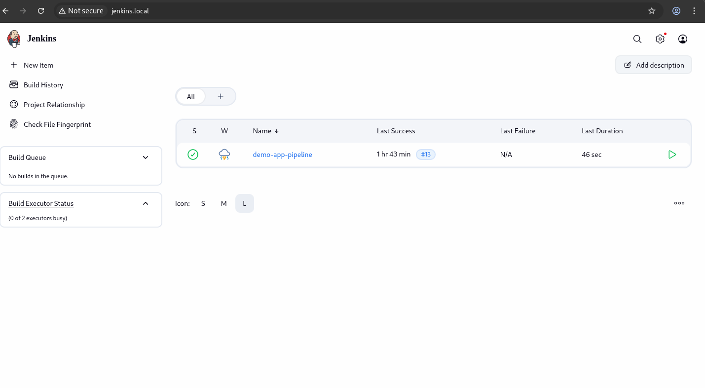

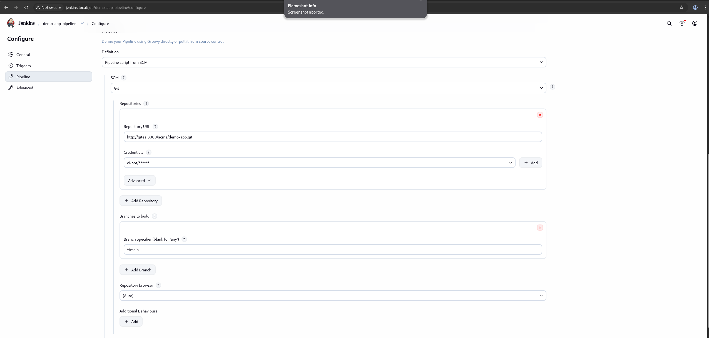

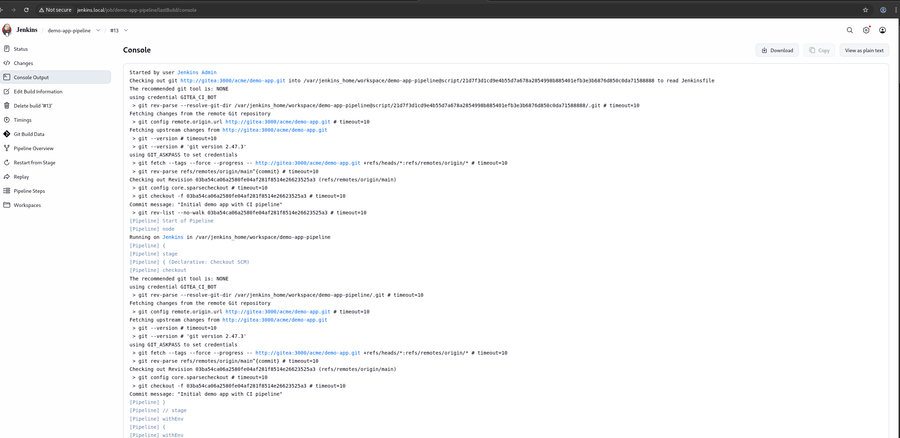

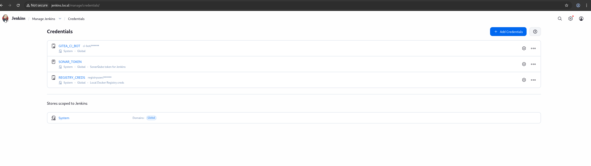

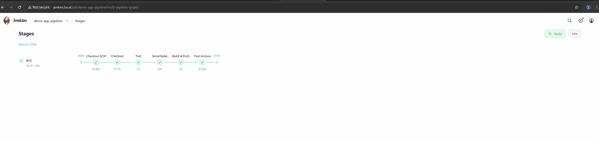

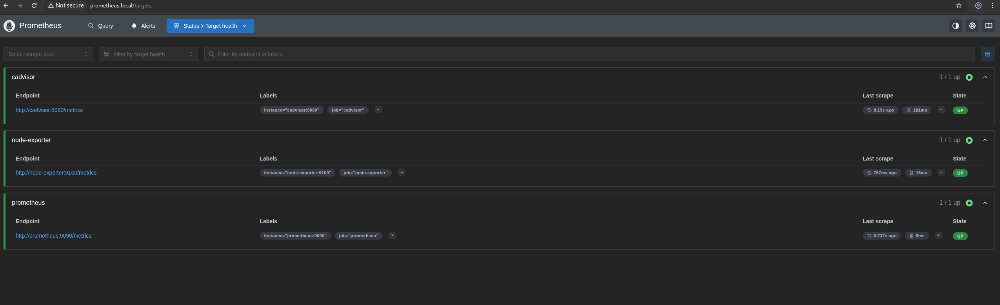

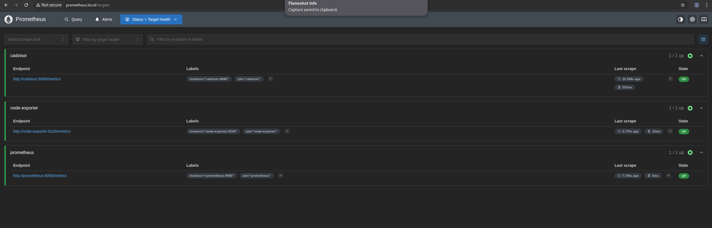

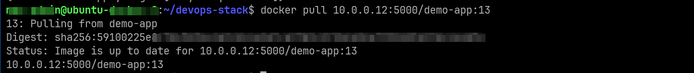

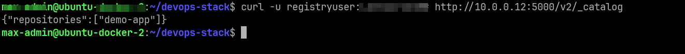

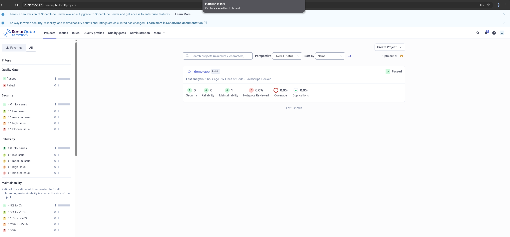

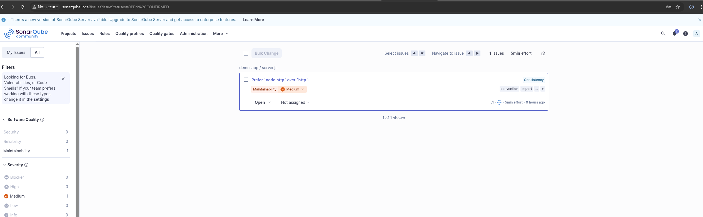

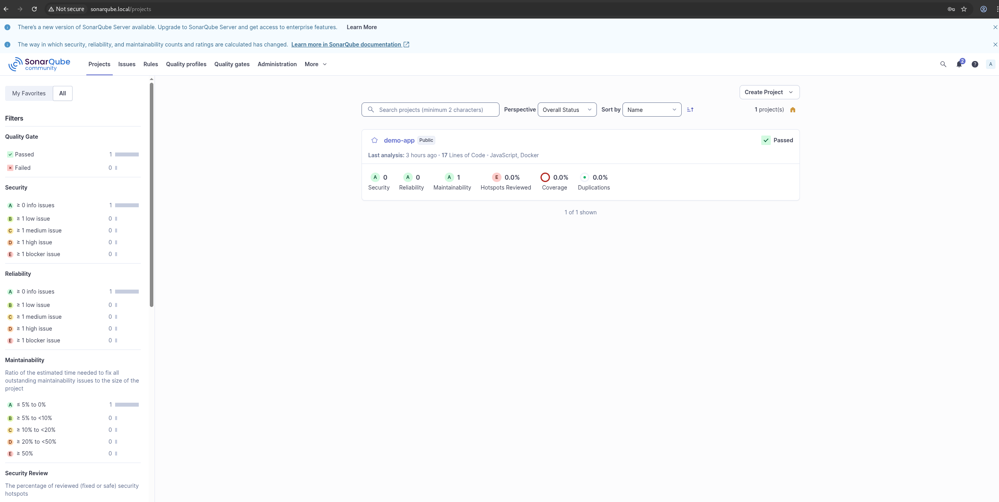

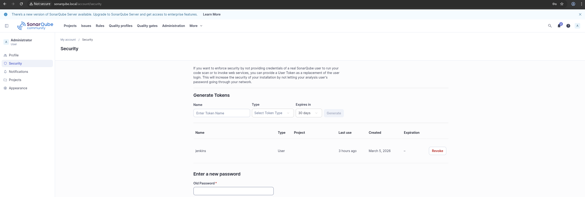

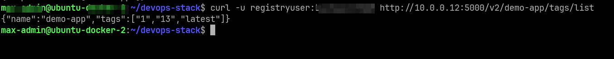